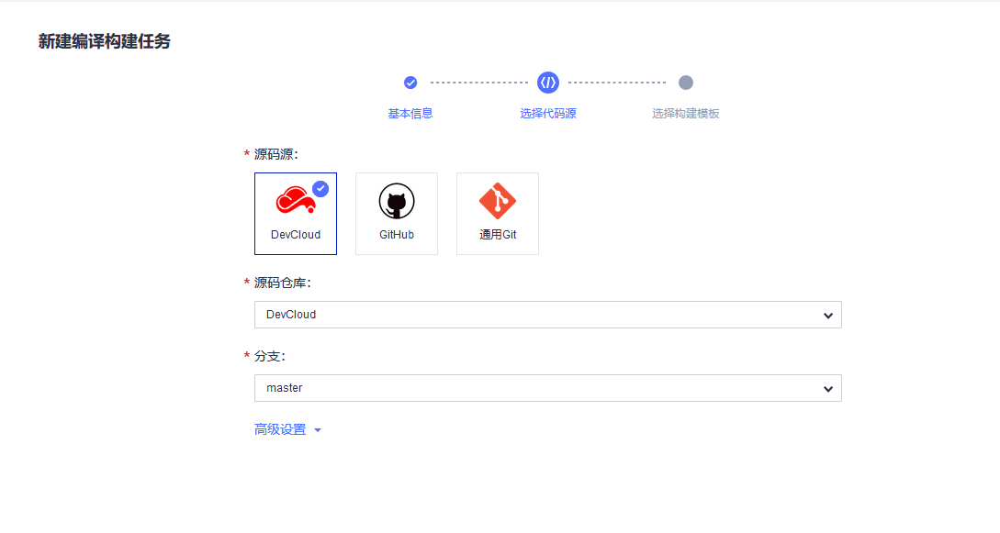
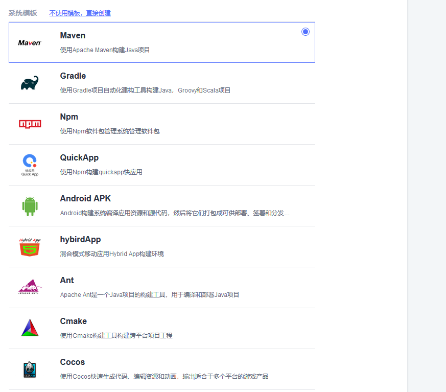
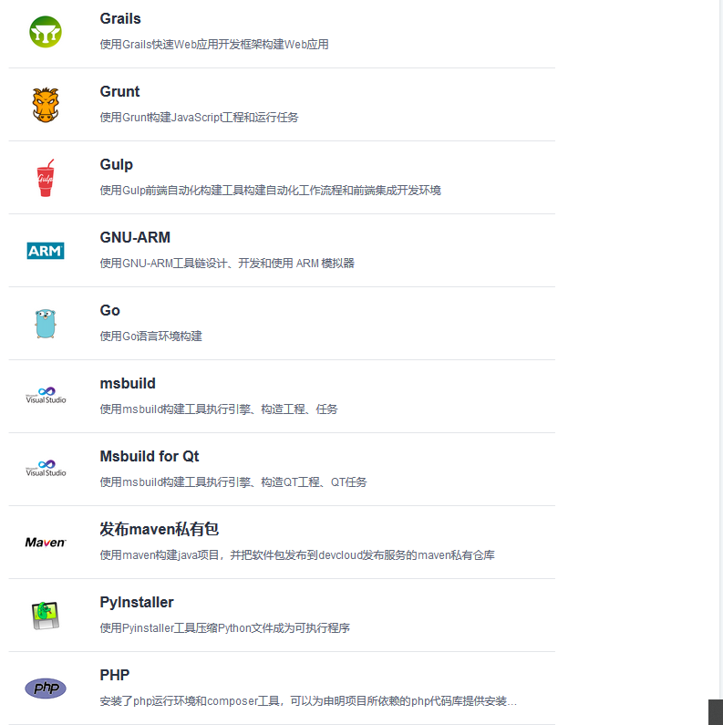
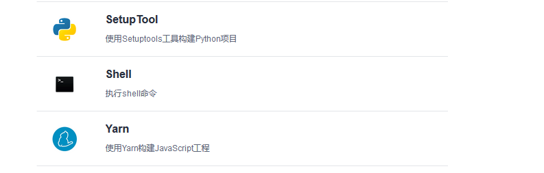
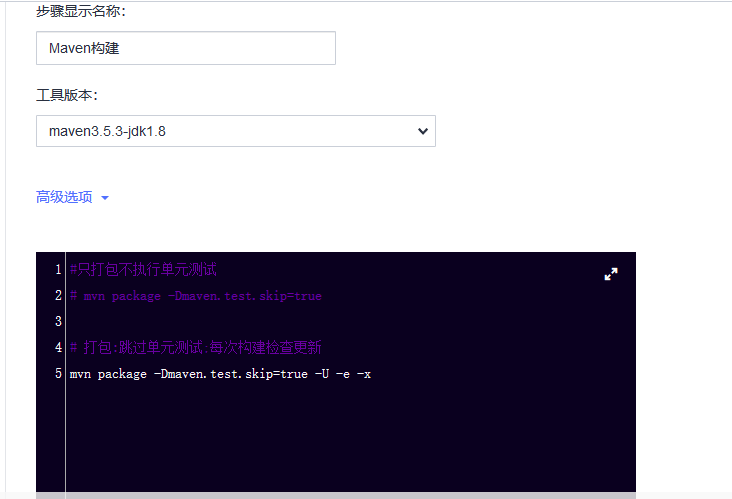
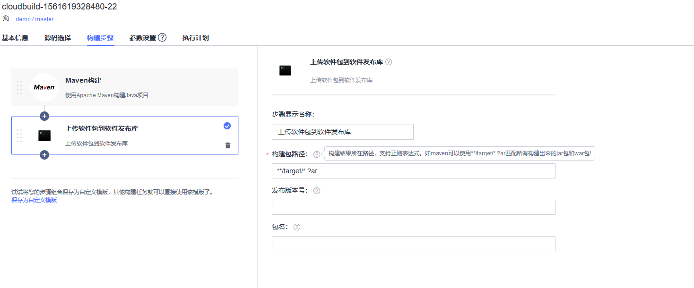
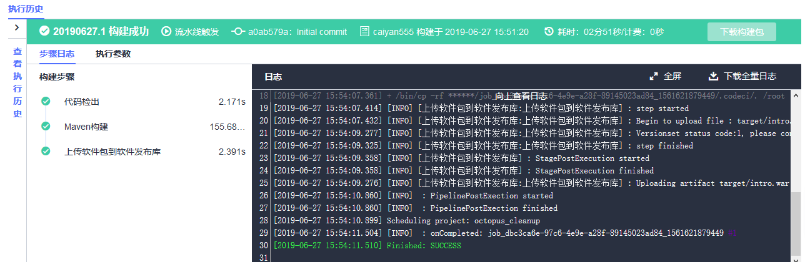

<!-- TOC -->

- [持续集成使用报告](#持续集成使用报告)
    - [横向对比结论](#横向对比结论)
        - [易用性](#易用性)
        - [自由度](#自由度)
    - [阿里云云效](#阿里云云效)
        - [ci配置步骤](#ci配置步骤)
            - [前置条件](#前置条件)
            - [重点功能使用简介](#重点功能使用简介)
            - [使用总结](#使用总结)
                - [优点](#优点)
                - [缺点](#缺点)
    - [华为云](#华为云)
        - [ci配置步骤](#ci配置步骤-1)
            - [重点功能使用简介](#重点功能使用简介-1)
            - [使用总结](#使用总结-1)
                - [优点](#优点-1)
                - [缺点](#缺点-1)
    - [ones.ai(未实践)](#onesai未实践)
        - [ci配置步骤](#ci配置步骤-2)
            - [使用说明](#使用说明)
            - [使用总结](#使用总结-2)
                - [优点](#优点-2)
                - [缺点](#缺点-2)

<!-- /TOC -->

# 持续集成使用报告

## 横向对比结论

### 易用性
- 华为云 >> 阿里云 >> ones.ai
- 华为云的配置流程比较清晰易懂
- 构建任务配置和流水线配置独立进行(流水线使用配置好的构建任务)
- 构建任务可以单独使用
- 代码提交触发构建流水线必须都是平台自身的代码仓库。不方便用户使用集成已有代码仓库。
- 华为云代码仓库一键导入比较方便(github)

### 自由度
- ones.ai >> 华为云 > 阿里云
- ones.ai 可以集成用户自己的服务器进行构建。更像一个独立的自动构建产品。
- 华为云和阿里云必须使用平台的服务器。和平台耦合度较强。
- 自动纳管部署构建环境，或平台部署时，创建构建池这种形式比较好。
- 华为云的构建任务和流水线相互独立，可以单独手动执行构建而不配置流水线。

## 阿里云云效

### ci配置步骤

#### 前置条件

1. 已经创建好项目
2. 已经创建好代码仓库 支持的语言包括:
- Java
- NodeJS
- PHP
- Python
- Go
- 自定义镜像

#### 重点功能使用简介

1. 创建流水线 流水线支持一下种类:
2. 流水线触发条件存在三种方式：手动触发 自动触发 定时触发
3. 自动触发配置代码仓库
4. 支持以下输入源

5. github配置webhook后,github代码提交后会向云效发送POST请求，云效随后执行相应构建。
6. githubwebhook配置

7. 可以在github上配置什么时候触发云效的构建
8. 执行过程及结果，可以查看日志

9. 执行完成后可以下载产物 内容包含打包产物和启动脚本

#### 使用总结

##### 优点

1. 功能健全,可以满足手动触发构建某个分支，定期构建分支，代码提交构建分支的要求。
2. webhook配置说明不够详细。
3. 触发功能丰富可以解决各种场景。
4. 有一些构建后置任务可以配置。例如测试用执行红线，代码安全扫描以及安全规约扫描。

##### 缺点 

1. 代码只支持码云和阿里云代码
2. 虽然可以配置github自动触发但是，构建产物不能基于github代码构建。

## 华为云

### ci配置步骤

#### 重点功能使用简介

1. 基本信息配置

2. 源代码配置

3. 配置构建模板 华为云支持的

4. 配置构建任务

- 可以修改构建指令(黑框部分)
- 可选工具版本

5. 配置结果上传配置

- 支持直接下载构建包

6. 配置流水线，选择配置好的构建任务

- 不支持外部代码仓库的自动触发

7. 查看结果

- 可以看日志
- 在页面直接下载结果包

#### 使用总结

##### 优点
1. 构建任务可以单独配置，比较灵活
2. 配置步骤比较简单

##### 缺点
1. 不支持第三方代码仓库触发构建

## ones.ai(未实践)

### ci配置步骤

#### 使用说明

https://ones.ai/project/#/pipeline/team/Hs4Ke7mV/pipeline/5soK8pSb/install

1. 准备服务器

2. 安装docker

3. 配置jenkins

4. 代码关联
https://ones.ai/project/#/pipeline/team/Hs4Ke7mV/pipeline/5soK8pSb/scm

5. 持续集成关联
https://ones.ai/project/#/pipeline/team/Hs4Ke7mV/pipeline/5soK8pSb/ci

#### 使用总结

##### 优点
1. 可以集成第三方服务器
2. 没有平台自身的强制绑定的产品

##### 缺点
1. 用户需要自己安装组件
2. 安装配置难度较高