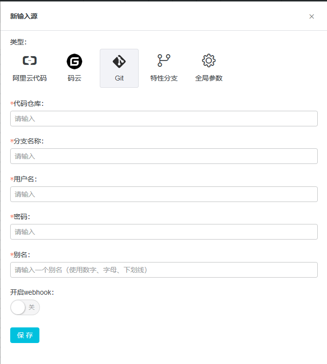
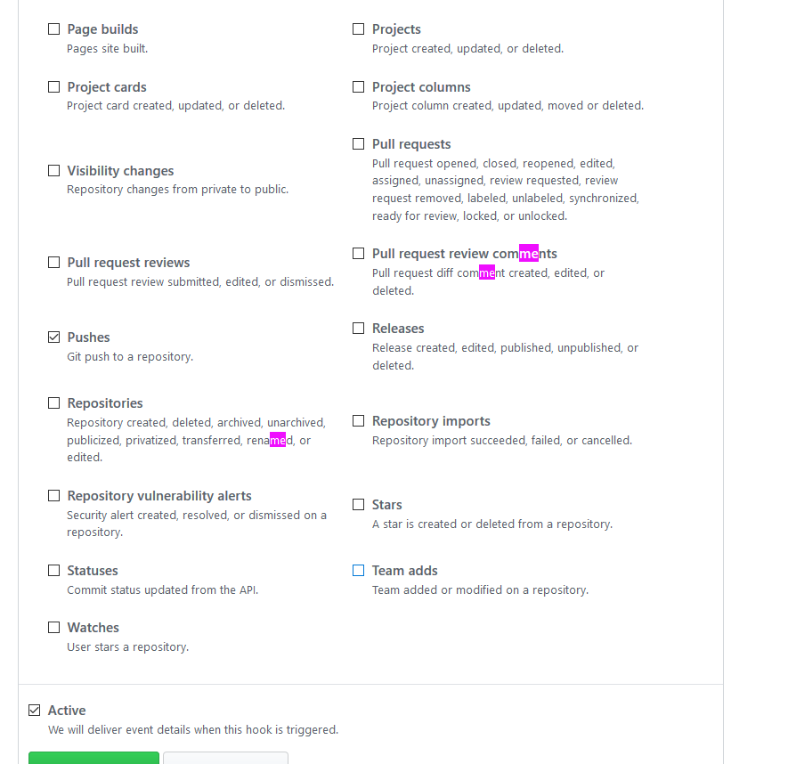
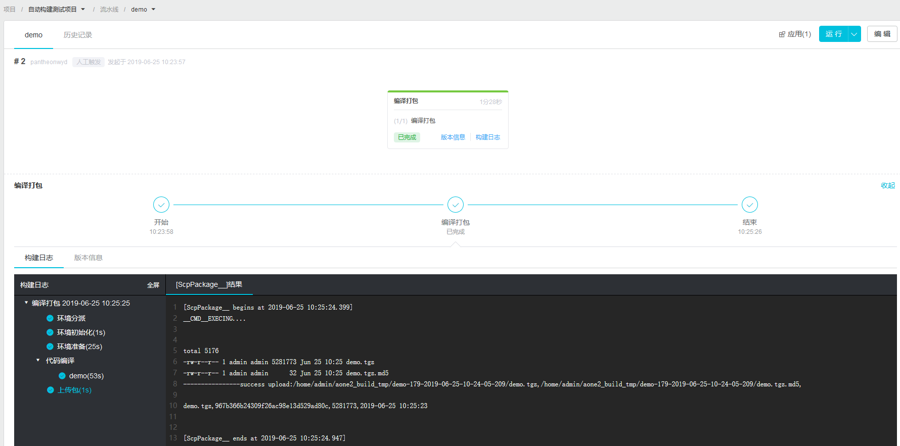
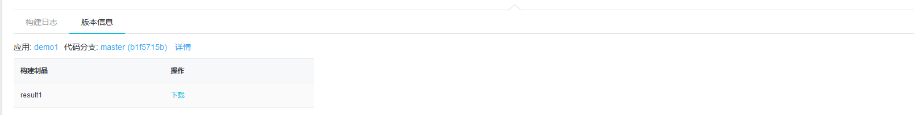

# 持续集成使用报告

## 阿里云云效

### ci配置步骤

#### 前置条件: 
1. 已经创建好项目
2. 已经创建好代码仓库 支持的语言包括:
- Java
- NodeJS
- PHP
- Python
- Go
- 自定义镜像

#### 重点功能使用简介
1. 创建流水线 流水线支持一下种类:
2. 流水线触发条件存在三种方式：手动触发 自动触发 定时触发
3. 自动触发配置代码仓库
4. 支持以下输入源

5. github配置webhook后,github代码提交后会向云效发送POST请求，云效随后执行相应构建。
6. githubwebhook配置

7. 可以在github上配置什么时候触发云效的构建
8. 执行过程及结果，可以查看日志

9. 执行完成后可以下载产物 内容包含打包产物和启动脚本

#### 使用总结
##### 优点
1. 功能健全,可以满足手动触发构建某个分支，定期构建分支，代码提交构建分支的要求。
2. webhook配置说明不够详细。
3. 触发功能丰富可以解决各种场景。
4. 有一些构建后置任务可以配置。例如测试用执行红线，代码安全扫描以及安全规约扫描。

## 2. 华为云3

## 3. visual studio tests